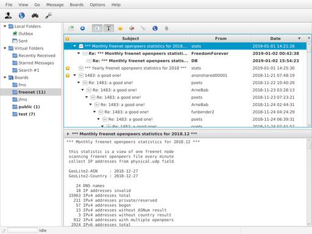

jfms
====

jfms is a Java implementation of the
[Freenet Message System (FMS)](/USK@0npnMrqZNKRCRoGojZV93UNHCMN-6UU3rRSAmP6jNLE,~BG-edFtdCC1cSH4O3BWdeIYa8Sw5DfyrSV-TKdO5ec,AQACAAE/fms/149/)
using the JavaFX toolkit.

It is a graphical application in style of a classic newsreader or email client:

jfms is beta software and still under development.

The essential features to run FMS are implemented:

* reading and posting of messages
* identity creation and announcement
* trust list management

Currently __not__ supported:

* audio CAPTCHAs
* board lists
* creating attachments

Source Code
------------

* [jfms-0.7.tar.gz](/CHK@LdC6o3MxNZ6HGs0q2qCyV7905yijsFLSOca5iMWktn0,bNDvCYESCUuDBxvFc4FO-NDRaXqcPT1p2GjN8ia4Omg,AAMC--8/jfms-0.7.tar.gz)

Refer to the `README.md` inside the archive for instructions on how to build
jfms from source.

Binaries
--------

* [jfms-0.7-bundle.jar](/CHK@GaHUJwtCCC4pskSY6mibD3zB02XEWzOO5RR91bC1kPY,g5zZXJ2-AVvSbkGhbJ5RrJg0MB5VsVDYXttsFVcILwE,AAMC--8/jfms-0.7-bundle.jar)

The bundle includes the SQLite JDBC driver by xerial (see Links section).
Linux, Mac, and Windows are supported.

Running
-------

Requirements:

* Java 8 (or higher) with JavaFX
* JDBC driver for SQLite (included in the bundle)
* network access to a Freenet node

JavaFX is included in Oracle Java SE 8 to 10. OpenJDK users may need to install
OpenJFX. Check the [FAQ](faq.html) if you are using a newer Java version.

You can run jfms by double-clicking the JAR file or start it from the
console:

	java -jar jfms-bundle.jar

On the first run a configuration wizard will pop up. The default settings
should work for most users.

It may take a while until you see messages. Currently, downloading the
initial set of trust lists may take more than one hour. This step should be
necessary only once.

All data will be stored in the working directory:

* `jfms.db3`: SQLite database containing identities and messages
* `jfms.properties`: configuration file
* `jfms.N.log`: log files

Support
-------

There is no exhaustive documentation, some issues are covered in the
[FAQ](faq.html).

For questions, bug reports, feature requests, etc. use the FMS board _jfms_.
Do not post complete logs, they may contain sensitive information.

If you discover security vulnerabilities, please send me a PGP encrypted message
via FMS.

PGP Public Key
--------------

	-----BEGIN PGP PUBLIC KEY BLOCK-----

	mQINBF4/6tkBEADA5iBOGe1g8amVCG6EnqFbrTDUDn6Dzf3b4ZE7XG2f1XMhDyfD
	GdOKZvczWs7pxdvQtfyN9e7bBaBrA50sfy6RtJDmGZRVTp4zw1JWBXdCvI9vxHdB
	DxX9W6W0qK3TUDOmtBD2m9Ji/G0j9g0SjlXnF/gMkrTr1jq+zZx6fLDhJfZgDP0R
	iOHq45AL5f2V4m4UMu8jVJBEHdX69oP/berQE1iLCvIFNrQUKHrL2aIUvNVbULT4
	TI96V+y0VPTuPpn6zkzSlkQoz0XOecmUOGIkt1mDpX80+KuesQSEZ7wfhu1AamOo
	QiCFk2uoCpv1WOzRVSBYS8L/c47JzOr6Dd1DcoRreVlQD/7KCc+M0hmGD8oNW/C2
	XDBoVpZ/08A/nYsaNYzNkiEhzdcyMl0IiDZisxjdkgh5bE+A7eHu2sojobbclKe7
	nwLvW1FM7fSSbGWU4sN0QnvXQS6v+zw7rbf+4aIq/UtYZBE6Y5fWBEvTOzVw6Qdh
	FCgDAqEIQhgI1evm0fsEYSIwVMjKgmAPjBzeaSyDShNURbnssaTnesQ8AAs1vyCL
	q7gheUv0T0hJk5uWy6F1uz1adSPYagf/tqYTDK42i4ueocsvsx6v82JEiEegjVL0
	NOqsD1XjF2AO8SHqYJ55RvgTvahfFmdSEoz97OumxO1sYTXH8GZfJ00kHwARAQAB
	tDlnbGVubiA8Z2xlbm5AT3FiOTVhZ1lITmVuRmxITGZIZWQ5MlpMYlJSczBPNHhI
	aWhuc21uSURRcz6JAlQEEwEIAD4WIQRdyF1c6mGE7B3mHLf/b/kVgrW5XAUCXj/q
	2QIbAwUJA8JnAAULCQgHAgYVCgkICwIEFgIDAQIeAQIXgAAKCRD/b/kVgrW5XB1v
	D/9Rfn52TG2tFBEJNxIow5FI9/lG2C/5xK+LbZhYCqpfCQGVbAYupRpPUHluBHIM
	pcV7xuTZ5h+QDwpiHoHgzTpNNjZ+CloiqTk1IPj9thpQ+d7Ncgj9Eis8OdJklcZU
	25q+bo1mYIm2Z+YfNJU8F7bPUObGL6fdpnLZD7EWyJWebbFLU/CgW3FIDnlEqO0o
	/PmJ5cjM/LhIt411mSyyEinnec9o+/spBjt28MLk0ukyOZd3TKJ1Pv2Zo1xttLtQ
	7FMELfAMx9Q1HDy0Dk+QWU4xS7ETHwvitkm26+IvF2fEK6y/S7UswJjfEdSk/gQy
	EEfDouM0k10r+6NCo27fjRi6obGY9QxCEtquP7HYs6M8TyDsCaTgmMSMH0K6fjFx
	pAt8V8OvTtssx8WiWy7DXP4Fq+Vc5sPR/d9Li4WYjceSD67yjRjdwtLYZypUuAMd
	Rx9AFRODbKoDXm/g95rhAzCuzicR0TG47fZYnTsR+t/9K2pLjoPisNseI3v+RvtT
	Xnv6puGTGdyTeiQ8/DjXWKiZQZA/n4J4UwNcn0J7L1O5+0yW8r8WltmL74zAsy32
	uacdVJiH36JiF4N1D12WUJm2QhbBbyFkMnnrq47xgBAY1k6SCxxwOQURYpN9LkXU
	TqRuptJToT8p66kGz05wwgz0+7LHUtTw1pAzA6CdjjQwzLkCDQReP+rZARAAwjEY
	kLTCwMcPzjfeetgU7V7y7E9ZWnzWdNeTsMOqoHyh//Tc3AuotwzdYORDxzNwVLt6
	1YP8cCFdBP7pqfKlZjauvV97C3qxeCqCfBCbbG8+sSriYsOeErZxZ49jKdPrnwcK
	dumeOVVEPTdanBroPnO5N6SuyP6/jhkA4Gf2xlWysapx+vrOTKJdaDxYU6U+uZ7T
	5RhlHZyID4EMSUMFDfThErVMLsT8CbeOfXYDu54PYmKZdTyWMoMCBCzbOcYWQVgx
	iRx7ZsOvf4bZyYAt+tXYEknWUz+rUsAClHdGtWwOkYY/+5j/x2ForHJ8xEOvOnUk
	eTLr1CJxFKUMUiIueWi1NCPWSUVYUNVIBvHOPBNeqnzRLen0oTfa6J25Bkf/RuOQ
	MFB+hx5svFdcl1MDDrI2J7VIKOBrENgb7m107tEdmli5CsdRHLQzxKhHy31mbiKP
	yiLc9SyLsyIyXVW2E82Bix3L2zLBBZA1w0+wXLxN618PSNSx48b4ClaaMj2MM+GB
	P1RiDzNoiYEJjerTEoIduS7IyRicBUyCHMedGuFt8UkQWdYqO96HOoxT7lrY5Qbg
	GzmS9uDiEKB/4GgNnp1FjCx019PSx5Uv0/dboWgeHlrsXM277uteAFzXRjbDPL88
	w7eEWNQgU1ll737rvNNO8xPoNWU5Rz1kflr4EE0AEQEAAYkCPAQYAQgAJhYhBF3I
	XVzqYYTsHeYct/9v+RWCtblcBQJeP+rZAhsMBQkDwmcAAAoJEP9v+RWCtblcFhYQ
	AI/q9O4fuCsEZqXC7x3veHs0W8aN1CdOEFo0dWWdEsPualvraCGa9fh5Vc1GVxwy
	3JT1qvGVA14Wz2te0yGT1o9Z8TYey8q7vYQ2LpXKe/J+auCJr6todHgUngFQxCNQ
	6XpLC3r0nJXBaR776FiN8Z1fPLHlhxwevEBcZ67Taa9dtq0h5kDNWdoAgiBRm2wF
	igNe6SEQdysG5ztHz9klGGqlSLuEIpk5votT6H9TU6MG8N3ZVd9nCOgVW+7URyf0
	Cy5K25kDeHyWtWmIRTp0h8dK9K5A2ANn2sq6eksC/cIQuGEU4/c+bBUBz7tmMFjO
	9LtcW15Yhgv7MunPSW0ZB6vNloNR5a8b/q59mD2DG7aNqX+bvEvtqZ2aSvkAvAtg
	NIsPMij5CFbsA3ZMfDXfOXUZ16iXvSlyUfmGtWvZyE1GSGBSiSrFY162Pkqyu7z+
	7uwcieSrxOFbNFxGByBFI+EV9PxDGN71ftQxjtOZV460e9rbE1whflnn2/fCs5/k
	KvopxWkqD8qTr2R+iyDNDwLIXGUEQZuZNe9UW/3H0VIOMFxZRzInnbA42xrDURlO
	aAWpst2ztgM0Xs8AC9g5wPAA01hYBgM1b4Zb1vuSGoqDiqRzwszr/bPgzZ2rlIuF
	bhVVIyVJl8692KOHqYkY6evmHI9Cbusg4brblxEBPdaN
	=QocP
	-----END PGP PUBLIC KEY BLOCK-----

Download as [file](glenn.asc).

Links
-----

* <https://github.com/xerial/sqlite-jdbc>: xerial's JDBC driver (external link)
* [sqlite-jdbc-3.30.1.jar](/CHK@~j0I7cBNbCpV0fj2tLRHfkyn5f61qlYSWgZhFEp31j4,6n~AGvY~KPqvceoL7HaT62~Fg4zOAkt43ZjnC8wtQcc,AAMC--8/sqlite-jdbc-3.30.1.jar): Freenet copy of JDBC driver
* [sqlite-jdbc-3.30.1.jar.asc](sqlite-jdbc-3.30.1.jar.asc): signature (by xerial)

### Bookmark

News
----

* 2020-02-16 - version 0.8 released
  * * trust list calculation is now based on flow-based reputation
  *   - default TLT for seed identities is now 90
  *   - existing seed identities with default TLT will be changed on update
  * support delayed sending of messages
  * fix NullPointerException if avatars are disabled
  * fix IllegalArgumentException if URI contains $
  * database maintenance is now working again (broken in 0.7)
* 2019-10-19 - version 0.7 released
  * add "mark all messages read" menu item
  * support avatars (disabled by default)
* 2019-04-05 - version 0.6 released
  * add drafts folder
  * add application icon
  * message menu: add find messages/subscribe board
  * bug fix: do not download messages from untrusted IDs
* 2019-01-04 - FAQ added and version 0.5 released
  * messages can now be marked (starred messages)
  * collapse threads with no unread messages (can be disabled via menu)
  * add menu item to mark thread as read
  * add menu item to delete a message
  * Recently Received folder: add option to show only messages from
    subscribed boards
  * optimize message download
  * enable fast message check by default for new installations
* 2018-09-10 - version 0.4 released
  * add option for fast message check on startup
  * fix sending of messages containing CDATA delimiters
  * highlight search results (WebView only)
  * add icons with 2x resolution
  * local identities can now be exported
  * configurable download/upload priorities
* 2018-07-01 - version 0.3 released
  * support message search
  * add virtual folder for recently received messages
  * support database maintenance
* 2018-06-02: version 0.2 released
  * support viewing of attachments
  * support link detection in messages
  * improve identity management
  * some minor UI improvements
* 2018-05-19: version 0.1.1 released
  * fix termination of trustlist download on invalid trust list
* 2018-05-18: version 0.1 released
